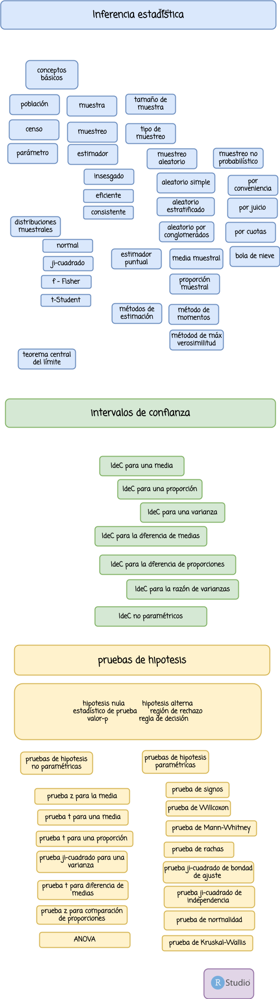

```{r setup, include=FALSE}
knitr::opts_chunk$set(echo = TRUE)


# colores
c0= "#FFCC00"
c1= "#FFAD42"
c2= "#FF5A42"
c3= "#E1286F"
c4= "#4983F6"
c5= "#783AC7"
c6= "#2C5697" # AZZUL INSTITUCIONAL
c7= "#F7F7F7" # FONDO GRIS CLARO WEB

```
 
 

<br/><br/>

<div class="highlight-box">

# **Introducción**

La inferencia estadística es una de las herramientas mas fuertes de la estadística que  permite la generalización de los resultados  obtenidos  en una muestra a  toda  la población. En este módulo encontraras los procedimientos que te permitirán realizar una correcta inferencia de tus datos.

</div>

<br/><br/>

<div class="highlight-box">
# **Objetivo**

Al finalizar el módulo el estudiante estará en capacidad de RECONOCER, INFERIR y CONSTRASTAR a partir de la estimación a través de INTERVALOS DE CONFIANZA  y PRUEBAS DE HIPOTESIS, permitiendo incorporar estas herramientas estadísticas a la toma de decisiones.

</div>

<br/><br/><br/>

# **Mapa**

<!--  -->

