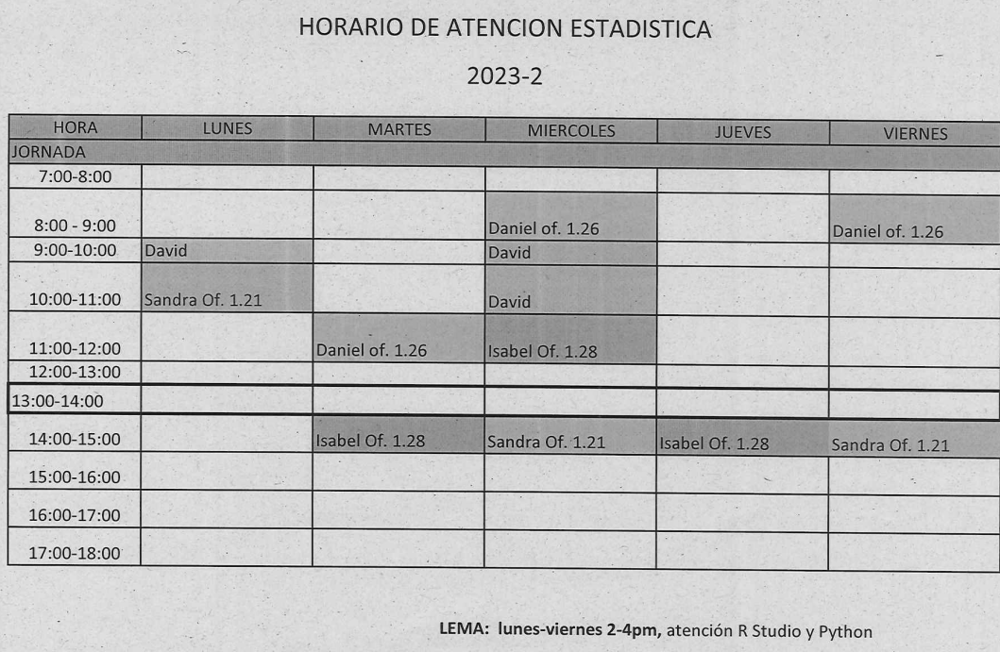

```{r setup, include=FALSE}
knitr::opts_chunk$set(echo = TRUE)
cg="#6c4675"

```

# **300MAE005 - D**

<br/><br/>


```{r, echo=FALSE, out.width="100%", fig.align = "center"}
# knitr::include_graphics("img/bannerG.png")
```


<br/><br/><br/>


```{r, echo=FALSE, out.width="100%", fig.align = "center"}
 knitr::include_graphics("img/modulos.png")
```
<br/><br/>

# **Metodología**
 
```{r, echo=FALSE, out.width="100%", fig.align = "center"}
# knitr::include_graphics("img/aulainvertida.png")
```
<br/><br/><br/>


# **Calendario 2024-2**

<br/><br/>


```{r, echo=FALSE, out.width="100%", fig.align = "center"}
knitr::include_graphics("img/CALENDARIO20242.png")
```

<br/><br/>


# **Salones**


|Curso     | **Grupo** | Horario       | **LUNES**  |                | **MARTES**    |                | **JUEVES**  |
|:---------|:----------|:--------------|:-----------|:---------------|:--------------|:---------------|:------------|
|300MAE005 |  **A**    | 7:00 A 9:00   |            |                |  **EC 2.4**   |                | **EC 2.4**  |
|          |           |               |            |                |               |                |             |
|          |           |11:00 a 13:00  | **PL 4.7** |                |               |                |             |
|          |           |               |            |                |               |                |             |


```{r, echo=FALSE, out.width="100%", fig.align = "center"}
 # knitr::include_graphics("img/salones.png")
```

<br/><br/>


**Profesor** : Daniel Enrique González Gómez 

* correo : dgonzalez@javerianacali.edu.co
* oficina : 1.28 Edificio de Ingeniería


**Monitor** : 


<br/><br/>

# **Atención a Estudiantes**


```{r, echo=FALSE, out.width="70%", fig.align = "center"}
#  
```

<br/><br/>

# **Información supletorios**


```{r, echo=FALSE, out.width="70%", fig.align = "center"}
 # knitr::include_graphics("img/supletorio1.png")
```

<br/><br/>


```{r, echo=FALSE, out.width="100%", fig.align = "center"}
# knitr::include_graphics("img/calendario2023-1bre.png")
```
