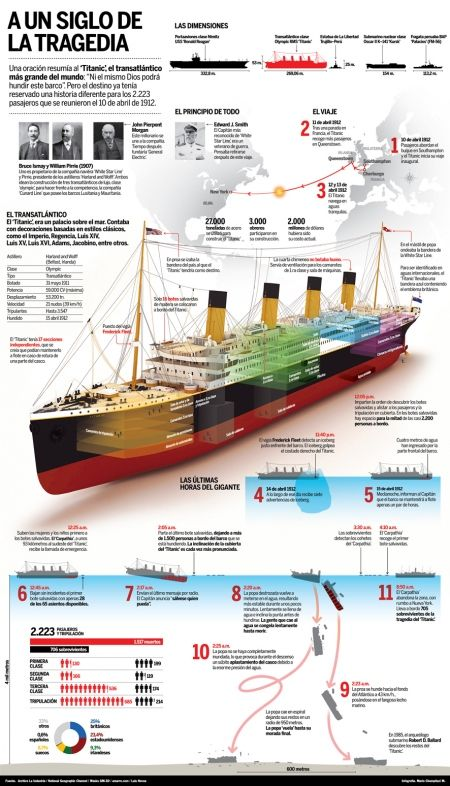
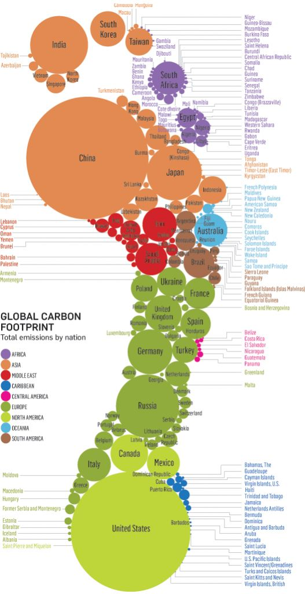
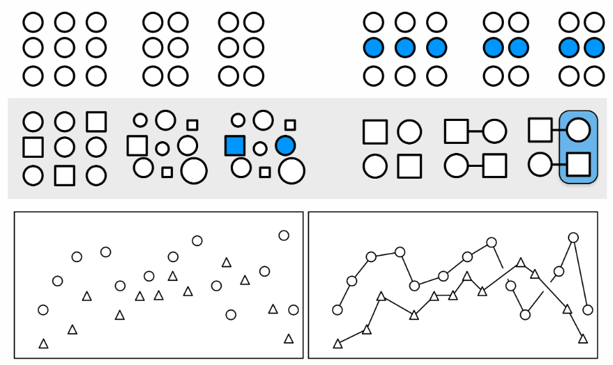
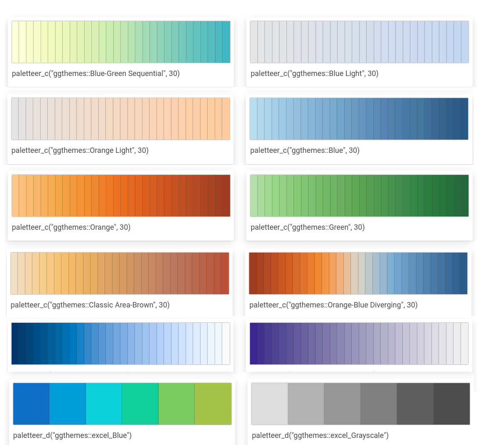
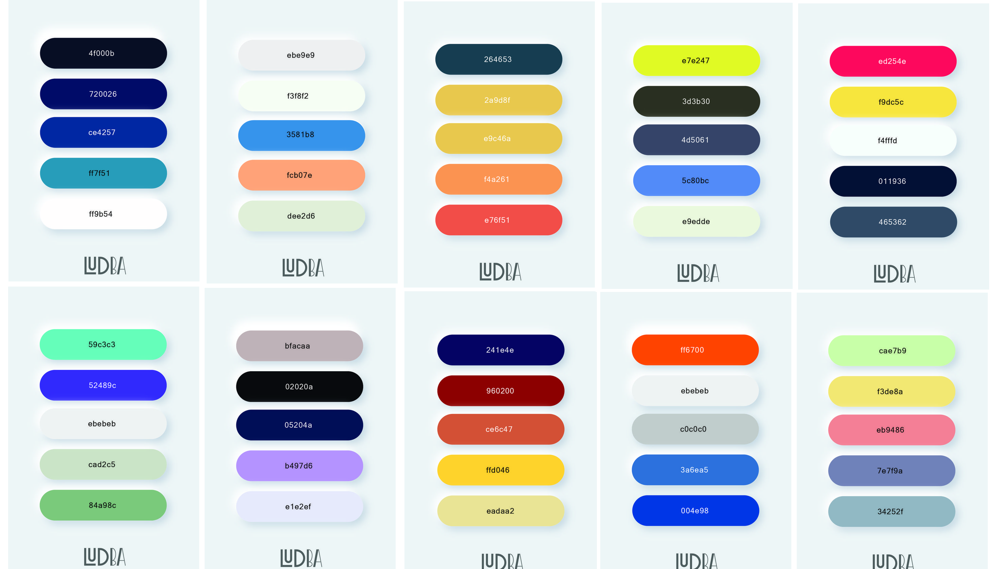
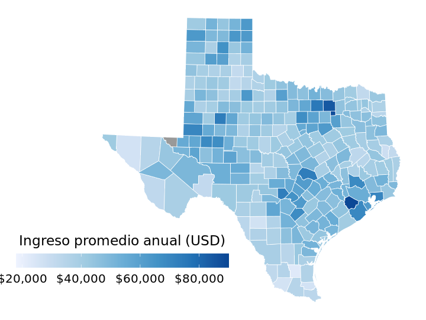
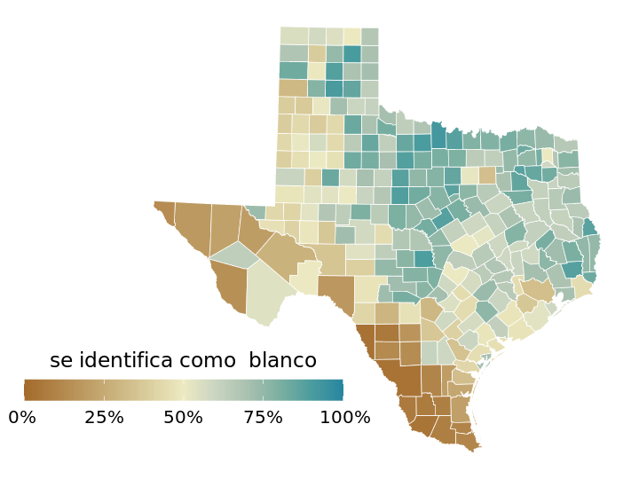

---
title: <span style="color:#235784"> </span>  
subtitle: <span style="color:#235784">**Unidad 1.1**</span> 
author: "dgonzalez "
output:
  html_document:
    toc: no
    toc_depth: 2
    toc_float: yes
    code_folding: hide
    theme: flatly
---    


```{r setup, include=FALSE}
options(htmltools.dir.version = FALSE)
knitr::opts_chunk$set(
  fig.width=9, fig.height=3.5, fig.retina=3,
  out.width = "100%",
  cache = FALSE,
  echo = TRUE,
  message = FALSE, 
  warning = FALSE,
  hiline = TRUE)

# colores
c0= "#FFCC00"
c1= "#FFAD42"
c2= "#FF5A42"
c3= "#E1286F"
c4= "#4983F6"
c5= "#783AC7"
c6= "#2C5697" # AZZUL INSTITUCIONAL
c7= "#F7F7F7" # FONDO GRIS CLARO WEB

paleta4=c(c0,c1,c2,c3)


library(forcats)
library(patchwork)
library(lubridate)
library(ggplot2)
library(gridExtra)
library(cowplot)
library(dviz.supp)
```


```{r, echo=FALSE, out.width="100%", fig.align="center"}

```


# **Visualización de datos**

En esta unidad se trataran los temas relacionados con :

* **Herramientas de visualización**
* **Gráficos básicos**
* **Tableros**


# **Herramientas de visualización**


<br/><br/><br/><br/>

## **Historia**

<br/>

```{r, echo=FALSE, out.width="80%", fig.align = "center"}

```
<br/>
<center>
Pintura rupestre de la Sierra de San Francisco
</center>

<br/><br/>


La Pintura Rupestre de la Sierra de San Francisco es un conjunto de arte rupestre prehistórico ubicado en la región montañosa de la península de Baja California, en México. Desde el punto de vista de la visualización de datos, este sitio arqueológico ofrece un fascinante ejemplo de cómo los seres humanos han utilizado las paredes de las cuevas como lienzos para expresar información visual y simbólica.

Estas pinturas datan de alrededor de 100 a.C. a 1300 d.C. y representan una amplia gama de temas, que van desde escenas cotidianas hasta figuras abstractas y animales estilizados. Desde el punto de vista de la visualización de datos, estas pinturas pueden considerarse como una forma primitiva de representación gráfica de información, donde los artistas utilizaron símbolos y figuras para transmitir mensajes y narrativas a través del tiempo.

Además, la distribución de las pinturas en diferentes cuevas y su variabilidad temática pueden interpretarse como un intento de los habitantes prehistóricos de la región de documentar su entorno, sus creencias y su historia de una manera visual y accesible.

<br/><br/><br/><br/>

<div class="content-box-gray">
## **Infografía**

<br/>
 
 
Una Infografía es una representación visual de información y datos, que utiliza recursos como imágenes, gráficos, mapas y texto para comunicar un mensaje de forma clara y concisa.
 
 Nigel Holmes
 
 </div>

<br/><br/>


```{r, echo=FALSE, out.width="80%", fig.align = "center"}

```

<br/><br/>

La infografía sobre el Titanic represen visualmente información clave sobre el famoso transatlántico. Incluir datos como la fecha de su construcción, el tamaño y peso del barco, la ruta planificada de su viaje inaugural, así como detalles sobre su trágico hundimiento, como la hora y la ubicación exacta. También muestra datos sobre la cantidad de pasajeros y tripulantes a bordo, junto con estadísticas sobre la supervivencia, como la proporción de pasajeros de primera, segunda y tercera clase que sobrevivieron. Mediante gráficos, diagramas y cifras destacadas, la infografía sobre el Titanic ofrecer una visión clara y concisa de uno de los eventos más trágicos y conocidos de la historia marítima.

Aunque proporciona información basada en datos reales, no tiene detras una base de datos.

<br/><br/><br/><br/>

## **Huella de carbono**

<br/>

```{r, echo=FALSE, out.width="60%", fig.align = "center"}

```

<br/><br/>

La **huella de carbono** corresponde a la cantidad de gases de efecto invernadero, principalmente dióxido de carbono (CO2), que se liberan a la atmósfera por las actividades humanas. Se calcula en toneladas de CO2 equivalente por persona o por país. La gráfica ilustra mediante circulos el aporte de cada pais.  Se destacan entre ellos China, el mayor emisor del mundo, seguido por Estados Unidos. Tambien se visualiza el aporte de cada continente.  Esta imagen contiede demasiada información que puede complejizar su interpretación.


## **Imagen de marca**

<br/>

```{r, echo=FALSE, out.width="60%", fig.align = "center"}

```

La imagen contiene información sobre el negocio online de una marca se refiere a la venta de sus productos o servicios a través de internet. Esto abarca la creación de una tienda online, la gestión de pedidos y envíos, el marketing digital y la atención al cliente. Refleja un aspecto humano y familiar creando una conexión directa sobre los lectores.


<br/><br/>

## Visualización de Minard (1896)

<br/>

```{r, echo=FALSE,  fig.align = "center",out.width="100%" }
knitr::include_graphics("img/Minard.png")
```
<br/>
Representa la marcha de Napoleón hacia Rusia  (422,000--> :  100,000 <--) <br/>
Charles Joseph Minard fue un ingeniero civil y pionero en el campo de la visualización de datos. 


La visualización de Minard es una de las representaciones gráficas más famosas en la historia de la estadística y la visualización de datos. Creada por el ingeniero francés Charles Joseph Minard en 1869, esta visualización representa la campaña militar de Napoleón en Rusia en 1812 y su posterior retirada.

Consiste en dos partes principales. 
* Un **mapa** de la campaña militar y un diagrama de líneas que muestra la evolución de las tropas de Napoleón durante la campaña. En el se representa la ruta de avance de las tropas francesas hacia Rusia y su posterior retirada. El número de soltados que partieron a Rusia y el número que regresaron están representados por el ancho de la linea - color café para el viaje de ida y en negro el viaje de regreso-. Incluyen detalles como las ciudades importantes, los ríos y las temperaturas registradas durante la marcha.

El diagrama de líneas, que se superpone al mapa, muestra la evolución de las fuerzas de Napoleón a lo largo del tiempo y del recorrido. Las líneas representan las tropas en la marcha hacia Moscú (café) y la retirada (negra), con la anchura de las líneas indicando el tamaño del ejército en cada etapa (422,000 al inicio y 100,000 de regreso). También se incluyen fechas clave y eventos importantes, como las batallas y las temperaturas extremas.

La visualización de Minard es elogiada por su capacidad para transmitir una gran cantidad de información de manera clara y efectiva. Además, se destaca por su habilidad para narrar visualmente la tragedia de la campaña de Rusia de Napoleón, mostrando de manera impactante la pérdida masiva de vidas y el colapso de las fuerzas francesas.


<br/><br/><br/>

# **Estética en la visualización**


La **estética** juega un papel fundamental en la visualización de datos, ya que ayuda a hacer que la información sea más comprensible y atractiva para el espectador. Entre las diferentes formas de estética utilizadas en la visualización, se encuentran:

* Forma
* Tamaño
* Color
* Ancho línea
* Tipo línea
* 1D, 2D, 3D

<br/><br/>

La **posición** se refiere a la ubicación de los elementos dentro de la visualización y es fundamental para transmitir información espacial. Por lo general haciendo referencia al plano cartesiano (2D) e indicando relaciones de asociación y correlación entre variables. 

La **forma** se refiere a la apariencia de los elementos, que puede ser útil para representar categorías o para resaltar ciertos datos, como pueden ser: circulos, cuadrados, triangulos, estrellas, entre otras formas. 

El **tamaño**, por otro lado, se utiliza para indicar magnitudes y hacer que ciertos elementos destaquen sobre otros.

El **color** es una de las estéticas más poderosas en la visualización, ya que puede transmitir información de manera rápida y efectiva. Se puede utilizar para representar categorías, resaltar elementos importantes o crear jerarquías visuales. Tambien reforzando el significado de la variable, por ejemplo en presentación de resultados de clima laboral se utilizan colores relacionados con el semaforo (escalas entre rojo y verde), para representar magnitudes desde colores suaves a colores fuertes para indicar grandes cantidades. Por último tambien se emplean colores para resaltar un nivel u objeto dentro de todo el grupo.

El **ancho de línea** y el **tipo de línea** se utilizan para diferenciar entre elementos y resaltar ciertos aspectos de la visualización.

La dimensión (1D, 2D, 3D) se refiere a la cantidad de dimensiones que se utilizan en la visualización. Mientras que las visualizaciones 1D se limitan a una sola dimensión, como una línea de tiempo, las visualizaciones 2D y 3D pueden representar información en dos o tres dimensiones, lo que permite una representación más detallada y compleja de los datos. Es recomendable no utilizar 3D para que las visializaciones sean más limpias y sencillas 

<br/><br/>

```{r , fig.width = 6, fig.asp = 0.5}
library(cowplot)
library(ggplot2)
library(grid)

# Definir la fuente (puede que necesites ajustar o eliminar esta línea si no tienes la fuente especificada)
dviz_font_family <- "sans"  # Cambia esto por la fuente que tienes instalada, o elimina esta línea si no es necesaria

aes_pos <- ggdraw() + 
  geom_segment(data = data.frame(x = c(0, 0.5),
                                 xend = c(1, 0.5),
                                 y = c(0.5, 0),
                                 yend = c(0.5, 1)),
               aes(x = x, y = y, xend = xend, yend = yend),
               arrow = arrow(length = grid::unit(12, "pt")), size = .75) +
  draw_text("y", .5, 1, size = 12, vjust = 1, hjust = 2.5, family = dviz_font_family) +
  draw_text("x", 1, .5, size = 12, vjust = 2, hjust = 1, family = dviz_font_family) + 
  coord_cartesian(xlim = c(-.2, 1.2), ylim = c(-.2, 1.2))

aes_color <- ggdraw() +
  geom_tile(data = data.frame(x = 0.15 + .2333*(0:3)),
            aes(x, y = .5, fill = factor(x)), width = .2, height = .6) +
  scale_fill_manual(values = c("#E69F00", "#56B4E9", "#009E73", "#F0E442"), guide = "none")

aes_shape <- ggdraw() +
  geom_point(data = data.frame(x = (.5 + 0:3)/4),
             aes(x, y = .5, shape = factor(x)), size = 8, fill = "grey80") +
  scale_shape_manual(values = 21:24)

aes_size <- ggdraw() +
  geom_point(data = data.frame(x = (.5 + 0:3)/4),
             aes(x, y = .5, size = factor(x)), shape = 21, fill = "grey80") +
  scale_size_manual(values = c(2, 5, 8, 11))

aes_lwd <- ggdraw() +
  geom_segment(data = data.frame(x = rep(0.05, 4),
                                 xend = rep(0.95, 4),
                                 y = (1.5 + 0:3)/6,
                                 yend = (1.5 + 0:3)/6,
                                 size = 4:1),
               aes(x = x, y = y, xend = xend, yend = yend, size = size)) +
  scale_size_identity()

aes_ltp <- ggdraw() +
  geom_segment(data = data.frame(x = rep(0.05, 4),
                                 xend = rep(0.95, 4),
                                 y = (1.5 + 0:3)/6,
                                 yend = (1.5 + 0:3)/6,
                                 linetype = 4:1),
               aes(x = x, y = y, xend = xend, yend = yend, linetype = linetype), size = 1) +
  scale_linetype_identity()

plot_grid(aes_pos, aes_shape, aes_size,
          aes_color, aes_lwd, aes_ltp,
          ncol = 3, 
          labels = c("posición", "forma", "tamaño", "color", "ancho línea", "tipo línea"),
          label_x = 0.05, label_y = 0.95, hjust = 0, vjust = 1)


```


<br/><br/>


## **Formas**

Es posible utilizar circulos, cuadrados, triangulos y en general figuras geométricas para resaltar puntos que represente valores numéricos en un plano 2D y de esta forma representar una secuencia o tendencia de la información.


<br/><br/>

```{r, echo=FALSE,  fig.align = "center",out.width="60%" }

```

<br/><br/>

## **Temperatura 2023**

Como ejemplo tomaremos la temperatura registrada en las cuatro principales ciudades de Colombia (Bogotá, Medellín, Cali y Barranquilla) en los doce meses del 2023.

<br/><br/>

```{r}

# Reemplaza "data" con tu data frame real
data <- data.frame(
  date = as.Date(c("2023-01-01", "2023-02-01", "2023-03-01", "2023-04-01", "2023-05-01", "2023-06-01", 
                   "2023-07-01", "2023-08-01", "2023-09-01", "2023-10-01", "2023-11-01", "2023-12-01",
                   #---------------------------------------------------------------------------------
                   "2023-01-01", "2023-02-01", "2023-03-01", "2023-04-01", "2023-05-01", "2023-06-01", 
                   "2023-07-01", "2023-08-01", "2023-09-01", "2023-10-01", "2023-11-01", "2023-12-01",
                   #---------------------------------------------------------------------------------
                   "2023-01-01", "2023-02-01", "2023-03-01", "2023-04-01", "2023-05-01", "2023-06-01", 
                   "2023-07-01", "2023-08-01", "2023-09-01", "2023-10-01", "2023-11-01", "2023-12-01",
                   #---------------------------------------------------------------------------------
                   "2023-01-01", "2023-02-01", "2023-03-01", "2023-04-01", "2023-05-01", "2023-06-01", 
                   "2023-07-01", "2023-08-01", "2023-09-01", "2023-10-01", "2023-11-01", "2023-12-01")),
  
  temperatura =	c(18.2,	19.3,	19.4,	17.6,	18.2, 18,	16.7,	17.1,	18.4,	18.2,	18.1,	19.6, # bogota
               	  25.2,	24.6,	25.1,	25.4,	26.3,	25.7,	26.3,	25.6,	24.9,	25.2,	25.4,	25.6, # medellin
          	      29.2, 29.4,	28.9,	28.5,	28.3,	28.1, 29.4,	29.1,	29.6,	27.8, 27.6,	28.3, # cali
                	30.2,	29.8, 31.3,	31.4,	32.4,	32.2,	32.1,	31.9,	32.2,	31.4,	31.2,	30.4), # barranquilla

       ciudad = c("1-Bogotá", "1-Bogotá", "1-Bogotá", "1-Bogotá", "1-Bogotá","1-Bogotá", 
                  "1-Bogotá", "1-Bogotá", "1-Bogotá", "1-Bogotá","1-Bogotá", "1-Bogotá",
                  "2-Medellín", "2-Medellín", "2-Medellín", "2-Medellín", "2-Medellín","2-Medellín", 
                  "2-Medellín", "2-Medellín", "2-Medellín", "2-Medellín","2-Medellín", "2-Medellín", 
                  "3-Cali", "3-Cali", "3-Cali", "3-Cali", "3-Cali", "3-Cali", 
                  "3-Cali", "3-Cali", "3-Cali", "3-Cali", "3-Cali", "3-Cali",  
                  "4-Barranquilla", "4-Barranquilla", "4-Barranquilla", "4-Barranquilla",
                  "4-Barranquilla","4-Barranquilla",  "4-Barranquilla", "4-Barranquilla", 
                  "4-Barranquilla", "4-Barranquilla","4-Barranquilla", "4-Barranquilla"))

head(data)
```

Una visualización puede ser una comparación por cidades a través de un diagrama de cajas. En este caso el color ayuda a relacionar la escla de la temperatura con calor , pasando de una azul relacionado con el frio a un naranja que puede indicar más calor.


<br/><br/>

```{r , fig.width=7, fig.align='center'}
library(ggplot2)
library(dplyr)
library(lubridate)

# Filtra las 4 ciudades principales
ciudades_principales <- c("1-Bogotá", "2-Medellín", "3-Cali", "4-Barranquilla")
temps_long <- data %>%
  filter(ciudad %in% ciudades_principales)
```

```{r, echo=FALSE}
# Paleta de colores cálidos
my_palette <- c("#0D3B66", "#209EBB", "#F4D35E", "#EE964B" , "#d73027")

# Crear el gráfico de caja con la paleta de colores cálidos
ggplot(data, aes(x = ciudad, y = temperatura, fill = ciudad)) +
  geom_boxplot() +
  labs(x = "Ciudad", y = "Temperatura") +
  scale_fill_manual(values = my_palette) +  # Utilizar la paleta de colores cálidos
  theme_minimal()

```

<br/><br/>

```{r , eval=FALSEfig.width=7, fig.align='center'}
# ggplot(temps_long, aes(x = date, y = temperatura, color = ciudad)) +
#   geom_line(size = 1) +
#   scale_x_date(name = "Mes", limits = c(ymd("2023-01-01"), ymd("2023-12-01")),
#                breaks = c(ymd("2023-01-01"), ymd("2023-02-01"), ymd("2023-03-01"),ymd("2023-04-01"), ymd("2023-05-01"),ymd("2023-06-01"),
#                           ymd("2023-07-01"), ymd("2023-08-01"), ymd("2023-09-01"),ymd("2023-10-01"), ymd("2023-11-01"),ymd("2023-12-01")),
#                labels = c("Ene", "Feb", "Mar", "Abr", "May", "Jun", "Jul", "Ago", "Sep", "Oct", "Nov", "Dic"), expand = c(1/12, 0)) +
#   scale_y_continuous(limits = c(15, 35), breaks = seq(15, 35, by = 5),
#                      name = "Temperatura (°C)") +
#   scale_color_manual(values = c("#0D3B66", "#209EBB", "#F4D35E", "#EE964B"))+
#   theme_dviz_grid() +
#   theme(legend.title.align = 0.5)

```


La representación mediante lineas es más apriada para este tipo de datos (series de tiempo) y de igualmanera se asocia un color a cada linea que transmita un menor o vayor valor de la temperatura.

<br/><br/>


## **Temperatura 2023**


```{r , fig.align='center'}
data <- data.frame( mes=rep(c("Ene", "Feb", "Mar", "Abr", "May", "Jun", "Jul", "Ago", "Sep", "Oct", "Nov", "Dic"), 4),
              ciudad =rep(c("1-Bogotá", "2-Medellín", "3-Cali", "4-Barranquilla"), c(12,12,12,12)),
              temperatura =	c(19,	19,	19,	18,	18, 18,	17,	17,	18,	18,	18,	19, # bogota
                                             25,	25,	25,	25,	26,	26,	26,	26,	25,	25,	25,	25, # medellin
                                             29, 29,	29,	28,	28,	28, 29,	29,	29,	28, 28,	28, # cali
                                             30,	30, 31,	31,	32,	32,	32,	32,	32,	31,	31,	30) # barranquilla
)
month_names <- c("01" = "Ene", "02" = "Feb", "03" = "Mar", "04" = "Abr", "05" = "May", "06" = "Jun",
                   "07" = "Jul", "08" = "Ago", "09" = "Sep", "10" = "Oct", "11" = "Nov", "12" = "Dic")

ciudad_names <- c("1-Botogá" ="Bogotá", "2-Medellín"= "Medellín" , "3-Cali" = "Cali", "4-Barranquilla" = "Barranquilla" )


# mean_temps <- temps_long %>%
#   group_by(ciudad, month) %>%
#   summarize(mean = mean(temperatura)) %>%
#   ungroup() %>%
#   mutate(month = month_names[month]) %>%
#   mutate(month = factor(month, levels = unname(month_names)))


  p <- ggplot(data, aes(x = mes, y = ciudad, fill = temperatura)) + 
       geom_tile(width = .95, height = 0.95) + 
       scale_fill_viridis_c(option = "D", begin = .4, end = 1,
                         name = "temperature (°C)") + 
    scale_y_discrete(name = NULL) +
    coord_fixed(expand = FALSE) +
    #theme_dviz_open() +
    theme(axis.line = element_blank(),
          axis.ticks = element_blank(),
         axis.text.y = element_text(size = 10),
          legend.title = element_text(size = 10)
          )


p
```

Es posible tambien

<br/><br/><br/>

## Coordenadas cartesianas

```{r , fig.align='center'}
df_points <- data.frame(x = c(-1, 0, 2),
                        y = c(-1, 0, 1),
                        label = c("(–1, –1)", "(0, 0)", "(2, 1)"),
                        vjust = c(1.4, -.8, -.8),
                        hjust = c(1.1, 1.1, -.1))

df_segments <- data.frame(x0 = c(0, 2, 0, -1),
                          x1 = c(2, 2, -1, -1),
                          y0 = c(1, 0, -1, 0),
                          y1 = c(1, 1, -1, -1))

df_labels <- data.frame(x = c(-1, -.5, 1, 2),
                        y = c(-.5, -1, 1, 0.5),
                        vjust = c(.5, 1.3, -.3, .5),
                        hjust = c(1.1, .5, .5, -.1),
                        label = c("y = –1", "x = –1", "x = 2", "y = 1"))

ggplot(df_points, aes(x, y)) +
  geom_hline(yintercept = 0, color = "gray50") +
  geom_vline(xintercept = 0, color = "gray50") +
  geom_segment(data = df_segments, aes(x = x0, xend = x1, y = y0, yend = y1),
               linetype = 2) +
  geom_point(size = 2, color = "#FF7F00") +
  geom_text(aes(label = label, vjust = vjust, hjust = hjust),
            size = 10/.pt, family = dviz_font_family) +
  geom_text(data = df_labels, aes(label = label, hjust = hjust, vjust = vjust),
            size = 10/.pt, family = dviz_font_family) +
  coord_fixed(xlim = c(-2.2, 3.2), ylim = c(-2.2, 2.2), expand = FALSE) +
  xlab("eje x") +
  ylab("eje y") +
  theme_dviz_grid() +
  theme(axis.ticks.length = grid::unit(0, "pt"))
```

<br/><br/>


## **Escala de los ejes**

```{r , fig.align='center', fig.width=10, fig.height=3}
data <- data.frame(
  mes = 1:12,
  Cali = rep("Cali", 12),
  temperatura = c(29, 28.5, 29.3, 28, 28.5, 28.6, 29.2, 29.5, 29.3, 28.5, 28.7, 28.3)
)

library(ggplot2)
library(dviz.supp)

temp_plot <- ggplot(data, aes(x = mes, y = temperatura, group = 1)) +
  geom_line(size = 1, color = "#0072B2") +
  scale_x_discrete(name = "mes", limits = month_names) +
  scale_y_continuous(limits = c(27, 30), name = "temperature (°C)") +
  theme_dviz_grid(8) +
  theme(plot.margin = margin(3, 5, 3, 1.5))

plot_grid(
  plot_grid(
    temp_plot, NULL, temp_plot, rel_widths = c(1, 0.06, 2), labels = c(" ", "", " "), nrow = 1
  ),
  NULL, temp_plot,
  rel_heights = c(1.5, 0.06, 1), labels = c("", "", " "), label_y = c(1, 1, 1.03), ncol = 1
)


```

<br/><br/><br/>

## Diferentes escalas

<br/>

#### **Datos : 1, 3.16, 10, 31.6, 100 **

<br/><br/>

```{r , fig.align='center'}
library(ggplot2)
library(cowplot)

df <- data.frame(x = c(1, 3.16, 10, 31.6, 100))

xaxis_lin <- ggplot(df, aes(x, y = 1)) + 
  geom_point(size = 3, color = "#0072B2") + 
  scale_y_continuous(limits = c(0.8, 1.2), expand = c(0, 0), breaks = 1) +
  theme_minimal() +
  theme(axis.ticks.length = grid::unit(0, "pt"),
        axis.text.y = element_blank(),
        axis.title.y = element_blank(),
        axis.ticks.y = element_blank(),
        plot.title = element_text(face = "plain"),
        plot.margin = margin(3, 14, 3, 1.5))

xaxis_log <- ggplot(df, aes(log10(x), y = 1)) + 
  geom_point(size = 3, color = "#0072B2") + 
  scale_y_continuous(limits = c(0.8, 1.2), expand = c(0, 0), breaks = 1) +
  theme_minimal() +
  theme(axis.ticks.length = grid::unit(0, "pt"),
        axis.text.y = element_blank(),
        axis.title.y = element_blank(),
        axis.ticks.y = element_blank(),
        plot.title = element_text(face = "plain"),
        plot.margin = margin(3, 14, 3, 1.5))

plotlist <- list(
  xaxis_lin + scale_x_continuous(limits = c(0, 100)) + ggtitle("Datos originales, escala lineal"),
  xaxis_log + scale_x_continuous(limits = c(0, 2)) + xlab(expression(paste("log"[10], "(x)"))) + ggtitle("Datos transformados, escala lineal"),
  xaxis_lin + scale_x_log10(limits = c(1, 100), breaks = c(1, 3.16, 10, 31.6, 100), labels = c("1", "3.16", "10", "31.6", "100")) + ggtitle("Datos originales, escala logarítmica"),
  xaxis_lin + scale_x_log10(limits = c(1, 100), breaks = c(1, 3.16, 10, 31.6, 100), labels = c("1", "3.16", "10", "31.6", "100")) + xlab(expression(paste("log"[10], "(x)"))) + ggtitle("Escala logarítmica con título de eje incorrecto")
)

# Agregar anotación personalizada al gráfico con título de eje incorrecto
plotlist[[4]] <- plotlist[[4]] + annotate("text", x = 0.5, y = 0.5, label = "Título de eje incorrecto", size = 6)

plot_grid(plotlist[[1]], plotlist[[2]], plotlist[[3]], plotlist[[4]], ncol = 1)

```

<br/><br/>


```{r}
library(ggplot2)

# Datos
x <- 1:5
y <- c(1, 3.16, 10, 31.6, 100)
lny <- log(x)

# Crear el dataframe
df <- data.frame(x = x, y = y, lny = lny)

# Gráfico de puntos
p1 <-ggplot(df, aes(x = x, y = y)) +
  geom_point(color = "orange", size = 4) +
  labs(title = " ",
       x = "x",
       y = "y") +
  theme_minimal()

p2 <- ggplot(df, aes(x = x, y = lny)) +
  geom_point(color = "orange", size = 4) +
  labs(title = " ",
       x = "x",
       y = "ln(y)") +
  theme_minimal()

plot_grid(
  p2, NULL, p1,
  labels = c("a", "", "b"), nrow = 1, rel_widths = c(1, .04, 1)
)
```


<br/><br/><br/>

## **Áreas de los países suramericanos**

```{r, fig.align='center'}
library(ggplot2)
library(gridExtra)

# Leer los datos
pais_areas <- read.csv(text = "Pais,area
BR, 8516
AR, 2780
PE, 1285
CO, 1142
BO, 1099
VE,  916
CH, 756
PA, 406
EC, 276
GY, 214
UR, 176
SR, 164")

pais_areas$Pais <- factor(pais_areas$Pais, levels = pais_areas$Pais)

# Crear el gráfico base
areas_base <- ggplot(pais_areas, aes(x = Pais, y = area)) +
  geom_col(fill = "#56B4E9") +
  ylab("área (km cuadrados)") +
  xlab("País") +
  theme_dviz_hgrid() +
  theme(plot.margin = margin(3, 1.5, 3, 1.5),
        axis.text.y = element_text(size = 8),
        axis.text.x = element_text(size = 8),
        axis.title.y = element_text(size = 10),
        axis.title.x = element_text(size = 10)
        )  

p1 <- areas_base + scale_y_sqrt(limits = c(0, 9000), breaks = c(0, 100, 500, 1000*(1:9)), 
                                expand = c(0, 0))

p2 <- areas_base + scale_y_continuous(limits = c(0, 9000), breaks = 1000*(0:9), expand = c(0, 0))

plot_grid(
  p2, NULL, p1,
  labels = c("a", "", "b"), nrow = 1, rel_widths = c(1, .04, 1)
)
 
```

(a) Escala lineal <br/>
(b) escala de raíz cuadrada


<br/><br/>

## Proyección de mapas

```{r , fig.align='center', fig.height=4}
library(sf)

world_sf <- sf::st_as_sf(rworldmap::getMap(resolution = "low"))

## world in long-lat
crs_longlat <- "+proj=longlat +ellps=WGS84 +datum=WGS84 +no_defs"

p_longlat <- ggplot(world_sf) + 
  geom_sf(fill = "#E69F00B0", color = "black", size = 0.5/.pt) + 
  coord_sf(expand = FALSE, crs = crs_longlat) + 
  scale_x_continuous(
    name = "longitude",
    breaks = seq(-160, 160, by = 20),
    labels = parse(text = c("NA", "NA", "120*degree*W", "NA", "NA", "60*degree*W", "NA", "NA", "0*degree", "NA", "NA", "60*degree*E", "NA", "NA", "120*degree*E", "NA", "NA"))
  ) +
  scale_y_continuous(
    name = "latitude",
    breaks = seq(-80, 80, by = 20),
    labels = parse(text = c("80*degree*S", "NA", "40*degree*S", "NA", "0*degree", "NA", "40*degree*N", "NA", "80*degree*N"))
  ) +
  theme_dviz_grid(12) +
  theme(
    panel.background = element_rect(fill = "#56B4E950", color = "grey30", size = 0.5),
    panel.grid.major = element_line(color = "gray30", size = 0.25),
    axis.ticks = element_line(color = "gray30", size = 0.5/.pt),
    plot.margin = margin(5, 10, 1.5, 1.5)
  )


## Interrupted Goode homolosine
crs_goode <- "+proj=igh"

# projection outline in long-lat coordinates
lats <- c(
  90:-90, # right side down
  -90:0, 0:-90, # third cut bottom
  -90:0, 0:-90, # second cut bottom
  -90:0, 0:-90, # first cut bottom
  -90:90, # left side up
  90:0, 0:90, # cut top
  90 # close
)
longs <- c(
  rep(180, 181), # right side down
  rep(c(80.01, 79.99), each = 91), # third cut bottom
  rep(c(-19.99, -20.01), each = 91), # second cut bottom
  rep(c(-99.99, -100.01), each = 91), # first cut bottom
  rep(-180, 181), # left side up
  rep(c(-40.01, -39.99), each = 91), # cut top
  180 # close
)

goode_outline <- 
  list(cbind(longs, lats)) %>%
  st_polygon() %>%
  st_sfc(
    crs = "+proj=longlat +ellps=WGS84 +datum=WGS84 +no_defs"
  ) %>% 
  st_transform(crs = crs_goode)

# bounding box in transformed coordinates
xlim_goode <- c(-21945470, 21963330)
ylim_goode <- c(-9538022, 9266738)
goode_bbox <- 
  list(
    cbind(
      c(xlim_goode[1], xlim_goode[2], xlim_goode[2], xlim_goode[1], xlim_goode[1]), 
      c(ylim_goode[1], ylim_goode[1], ylim_goode[2], ylim_goode[2], ylim_goode[1])
    )
  ) %>%
  st_polygon() %>%
  st_sfc(crs = crs_goode)

# area outside the earth outline
goode_without <- st_difference(goode_bbox, goode_outline)

p_goode <- ggplot(world_sf) + 
  geom_sf(fill = "#E69F00B0", color = "black", size = 0.5/.pt) +
  geom_sf(data = goode_without, fill = "white", color = NA) +
  geom_sf(data = goode_outline, fill = NA, color = "grey30", size = 0.5/.pt) +
  scale_x_continuous(
    name = NULL,
    breaks = seq(-160, 160, by = 20)
  ) +
  scale_y_continuous(
    name = NULL,
    breaks = seq(-80, 80, by = 20)
  ) + 
  coord_sf(xlim = 0.95*xlim_goode, ylim = 0.95*ylim_goode, expand = FALSE, crs = crs_goode, ndiscr = 1000) + 
  theme_dviz_grid(12, rel_small = 1) +
  theme(
    panel.background = element_rect(fill = "#56B4E950", color = "white", size = 1),
    panel.grid.major = element_line(color = "gray30", size = 0.25),
    plot.margin = margin(1.5, 1.5, 24, 1.5)
  )


## Robinson projection
crs_robin <- "+proj=robin +lat_0=0 +lon_0=0 +x0=0 +y0=0"

# projection outline in long-lat coordinates
lats <- c(90:-90, -90:90, 90)
longs <- c(rep(c(180, -180), each = 181), 180)

robin_outline <- 
  list(cbind(longs, lats)) %>%
  st_polygon() %>%
  st_sfc(
    crs = "+proj=longlat +ellps=WGS84 +datum=WGS84 +no_defs"
  ) %>% 
  st_transform(crs = crs_robin)

# bounding box in transformed coordinates
xlim_robin <- c(-18494733, 18613795)
ylim_robin <- c(-9473396, 9188587)
robin_bbox <- 
  list(
    cbind(
      c(xlim_robin[1], xlim_robin[2], xlim_robin[2], xlim_robin[1], xlim_robin[1]), 
      c(ylim_robin[1], ylim_robin[1], ylim_robin[2], ylim_robin[2], ylim_robin[1])
    )
  ) %>%
  st_polygon() %>%
  st_sfc(crs = crs_robin)

# area outside the earth outline
robin_without <- st_difference(robin_bbox, robin_outline)

p_robin <- ggplot(world_sf) + 
  geom_sf(fill = "#E69F00B0", color = "black", size = 0.5/.pt) + 
  geom_sf(data = robin_without, fill = "white", color = NA) +
  geom_sf(data = robin_outline, fill = NA, color = "grey30", size = 0.5/.pt) +
  scale_x_continuous(
    name = NULL,
    breaks = seq(-160, 160, by = 20)
  ) +
  scale_y_continuous(
    name = NULL,
    breaks = seq(-80, 80, by = 20)
  ) +
  coord_sf(xlim = 0.95*xlim_robin, ylim = 0.95*ylim_robin, expand = FALSE, crs = crs_robin, ndiscr = 1000) + 
  theme_dviz_grid(12, rel_small = 1) +
  theme(
    panel.background = element_rect(fill = "#56B4E950", color = "white", size = 1),
    panel.grid.major = element_line(color = "gray30", size = 0.25),
    plot.margin = margin(6, 1.5, 1.5, 1.5)
  )


## Winkel tripel
# The Winkel tripel projection needs to be done manually, it is not supported by sf.
crs_wintri <- "+proj=wintri +datum=WGS84 +no_defs +over"

# world
world_wintri <- lwgeom::st_transform_proj(world_sf, crs = crs_wintri)

# graticule
grat_wintri <- sf::st_graticule(lat = c(-89.9, seq(-80, 80, 20), 89.9))
grat_wintri <- lwgeom::st_transform_proj(grat_wintri, crs = crs_wintri)

# earth outline
lats <- c(90:-90, -90:90, 90)
longs <- c(rep(c(180, -180), each = 181), 180)
wintri_outline <- 
  list(cbind(longs, lats)) %>%
  st_polygon() %>%
  st_sfc(
    crs = "+proj=longlat +ellps=WGS84 +datum=WGS84 +no_defs"
  ) %>% 
  lwgeom::st_transform_proj(crs = crs_wintri)

p_wintri <- ggplot() + 
  geom_sf(data = wintri_outline, fill = "#56B4E950", color = NA) +
  geom_sf(data = grat_wintri, color = "gray30", size = 0.25/.pt) + 
  geom_sf(data = world_wintri, fill = "#E69F00B0", color = "black", size = 0.5/.pt) + 
  geom_sf(data = wintri_outline, fill = NA, color = "grey30", size = 0.5/.pt) +
  coord_sf(datum = NA, expand = FALSE) +
  theme_dviz_grid(12, rel_small = 1) +
  theme(
    plot.margin = margin(6, 1.5, 3, 1.5)
  )

p <- plot_grid(
  p_longlat, p_goode, p_robin, p_wintri,
  labels = c("(a)", "(b)","(c)", "(d)") 
)

p + theme(plot.margin = margin(5, 1, 1, 0),
          axis.title = element_text(size=8))
```

(a) Miller, (b) sinusoidal, (c) Robinson, (d) Winkel 

<br/><br/>

## **Mapa de Colombia - proyección de Miller**

```{r , fig.align='center'}
# Cargar las bibliotecas necesarias
library(sf)
library(rnaturalearth)
library(ggplot2)
library(gridExtra)

# Obtener los datos de los departamentos de Colombia
colombia_deptos <- ne_states(country = "Colombia", returnclass = "sf")

# Obtener los datos de los países de Sudamérica
sudamerica <- ne_countries(continent = "South America", returnclass = "sf")

# Filtrar Colombia
colombia <- sudamerica[sudamerica$ADMIN == "Colombia", ]

# Dibujar el mapa de Sudamérica con Colombia resaltado en azul claro
p_sudamerica <- ggplot() +
  geom_sf(data = sudamerica, fill = "gray80", color = "black") +
  geom_sf(data = colombia, fill = "lightblue", color = "black") +
  theme_minimal() +
  ggtitle("Sudamérica") +
  theme(plot.title = element_text(hjust = 0.5))

# Dibujar el mapa de Colombia con los departamentos en azul claro
p_colombia <- ggplot() +
  geom_sf(data = colombia_deptos, fill = "lightblue", color = "black") +
  theme_minimal() +
  ggtitle("Colombia") +
  theme(plot.title = element_text(hjust = 0.5),
        plot.margin = margin(5, 1, 1, 0),
        axis.title = element_text(size=8))


# Mostrar los dos mapas juntos
grid.arrange(p_sudamerica, p_colombia, ncol = 2)

```

<br/><br/>

## **Escala de colores**


* Para distinguir grupos
* Para representar valores de datos
* Para resaltar


```{r, fig.height=5}
library(ggplot2)
library(dplyr)
library(scales)
library(readr)
poblacionCo<- read_csv("data/poblacopnCo23.csv")

# Mostrar los datos ordenados por población de mayor a menor
poblacionCo <- poblacionCo %>%
  arrange(desc(poblacion))

# make color and fontface vector in order of the states
region_colors_bars <- c("#E69F00", "#56B4E9", "#009E73", "#F0E442", "#0072B2")
region_colors_axis <- c("gray30", "gray30", "gray30", "gray30", "gray30")
region_fontface <- c("plain", "plain", "plain", "plain", "plain")
state_colors <- region_colors_bars[match(poblacionCo$zona, c("Amazonía", "Andina", "Orinoquía", "Caribe", "Pacífica"))]
state_fontface <- region_fontface[match(poblacionCo$zona, c("Amazonía", "Andina", "Orinoquía", "Caribe", "Pacífica"))]

ggplot(poblacionCo, aes(x = reorder(departamento, poblacion), y = poblacion, fill = zona)) + 
  geom_col() + 
  scale_y_continuous(
    labels = scales::comma,
    name = "Población",
    expand = expansion(mult = c(0, 0.05))
  ) +
  scale_fill_manual(
    values = region_colors_bars,
    breaks = c("Amazonía", "Andina", "Orinoquía", "Caribe", "Pacífica", "Pacífico"),
    labels = c("Amazonía", "Andina", "Orinoquía", "Caribe", "Pacífica", "Pacífico")
  ) +
  coord_flip() + 
  theme_minimal() +
  theme(
    text = element_text(color = "gray30"),
    axis.text.y = element_text(
      size = 8, color = "gray30",
      face = state_fontface
    ),
    legend.position = "right",
    legend.justification = "center",
    legend.box.just = "right",
    legend.background = element_rect(fill = "white", color = "gray80")
  ) +
  labs(
    x = "Departamento",
    title = "Población proyectada por departamento en Colombia (2023)"
  )

```


<br/><br/>

## Colores - resaltar


```{r}
library(ggplot2)
library(dplyr)
library(scales)
library(readr)
poblacionCo<- read_csv("data/poblacopnCo23.csv")

# Mostrar los datos ordenados por población de mayor a menor
poblacionCo <- poblacionCo %>%
  arrange(desc(poblacion))

ggplot(poblacionCo, aes(x = reorder(departamento, poblacion), y = poblacion, fill = departamento)) + 
  geom_col() + 
  geom_text(aes(label = poblacion), hjust = -0.1, size = 2, color = "gray30") +  # Agregar etiquetas de población
  scale_y_continuous(
    labels = scales::comma,
    name = "Población",
    expand = expansion(mult = c(0, 0.05))
  ) +
  scale_fill_manual(
    values = c(rep("#B9D1EA",29), "#00265E", "#B9D1EA","#B9D1EA","#B9D1EA"),
    guide = FALSE
  ) +
  coord_flip() + 
  theme_minimal() +
  theme(
    text = element_text(color = "gray30"),
    axis.text.y = element_text(size = 5, color = "gray30", face = state_fontface),
    axis.text.x = element_text(size = 5, color = "gray30", face = state_fontface),    
    legend.position = "none",
    plot.margin = margin(1, 1, 1, 2),
    axis.title = element_text(size=6)) +
  labs(
    x = "Departamento",
    title = "Población proyectada por departamento en Colombia (2023)"
  )

```

<br/><br/>


## Paletas de colores

```{r, echo=FALSE, out.width="100%", fig.align = "center"}

```

<br/>

```{r, echo=FALSE, out.width="100%", fig.align = "center"}

```

<br/>

```{r, echo=FALSE, out.width="30%", fig.align = "center"}

```


https://r-charts.com/es/colores/

<br/><br/><br/>

## Color - representar valores de datos

```{r, echo=FALSE, fig.align = "center"}

```


<br/><br/>

## Color - representar valores de datos

```{r, echo=FALSE,  fig.align = "center"}

```


<br/><br/>
## Casos de violencia sexual 2021

```{r , fig.align = "center"}
library(readr)
require(sp)
#require(rgdal)
require(raster)
require(RColorBrewer)

vsex2021 <- read_csv("data/violencia_sex_2021.csv")
# Suponiendo que tu base de datos se llama 'datos' y tiene una columna 'departamento' y una columna 'tasa'
# Sumar la variable 'tasa' por 'departamento' usando tapply
vsex21 = data.frame(casos <- tapply(vsex2021$casos, vsex2021$cdep, sum),
                    casosm <- tapply(vsex2021$casosm, vsex2021$cdep, sum),
                    casosh <- tapply(vsex2021$casosh, vsex2021$cdep, sum)) 

# Crear la variable departamento basada en los nombres de fila
vsex21$departamento <- rownames(vsex21)
names(vsex21) = c("casos", "casosm", "casosh","cdep")
vsex21$cdep[c(1,2)] =c("05","08")
# Mostrar el resultado

dptos <- data.frame(id = 1:33,
                    ndep =c("ANTIOQUIA","ATLANTICO","SANTAFE DE BOGOTA D.C", "BOLIVAR","BOYACA", "CALDAS","CAQUETA","CAUCA", "CESAR", "CORDOBA","CUNDINAMARCA", "CHOCO","HUILA", "LA GUAJIRA", "MAGDALENA","META","NARIÑO","NORTE DE SANTANDER","QUINDIO","RISARALDA", "SANTANDER", "SUCRE","TOLIMA", "VALLE DEL CAUCA","ARAUCA", "CASANARE", "PUTUMAYO", "AMAZONAS", "GUAINIA",  "GUAVIARE", "VAUPES", "VICHADA", "ARCHIPIELAGO DE SAN ANDRES PROVIDENCIA Y SANTA CATALINA"),
                    cdep =c("05","08","11","13","15","17","18","19","20","23","25","27","41","44","47","50","52","54","63","66","68","70","73","76","81","85","86","91","94","95","97","99","88")
)
# Merge de dptos con vsex21
dptos <- merge(dptos, vsex21, by.x = "cdep", by.y = "cdep", all.x = TRUE)
#------------------------------------

mi.palette <- brewer.pal(n = 7, name = "YlOrRd")   # paleta de colores
mapco=shapefile("/home/deg/Documentos/JAVERIANA/EDUCON/repository/cursoML/presenta1/depto.shp")  # importa mapa en formato .shp
casos <- dptos$casos

mapco@data$casos=casos # se adiciona variable con 33 valores = 33 dptos, en mismo orden
spplot(mapco[,6], col.regions = mi.palette, cuts = 6)  # mapa


```

<br/><br/>


## Casos de violencia sexual 2021


```{r,fig.align='center'}
library(ggplot2)
library(dplyr)
library(scales)
library(readr)

# Leer el archivo CSV
vsex2021 <- read_csv("data/violencia_sex_2021.csv")

# Sumar la variable 'casos', 'casosm', y 'casosh' por 'cdep' usando dplyr
vsex21 <- vsex2021 %>%
  group_by(cdep) %>%
  summarise(casos = sum(casos),
            casosm = sum(casosm),
            casosh = sum(casosh))

# Crear el dataframe dptos
dptos <- data.frame(
  id = 1:33,
  ndep = c("ANTIOQUIA","ATLANTICO","SANTAFE DE BOGOTA D.C", "BOLIVAR","BOYACA", "CALDAS","CAQUETA","CAUCA", "CESAR", "CORDOBA","CUNDINAMARCA", "CHOCO","HUILA", "LA GUAJIRA", "MAGDALENA","META","NARIÑO","NORTE DE SANTANDER","QUINDIO","RISARALDA", "SANTANDER", "SUCRE","TOLIMA", "VALLE DEL CAUCA","ARAUCA", "CASANARE", "PUTUMAYO", "AMAZONAS", "GUAINIA",  "GUAVIARE", "VAUPES", "VICHADA", "SN ANDRES-STA CATALINA"),
  cdep = c("5","8","11","13","15","17","18","19","20","23","25","27","41","44","47","50","52","54","63","66","68","70","73","76","81","85","86","91","94","95","97","99","88")
)

# Merge de dptos con vsex21
dptos <- merge(dptos, vsex21, by = "cdep", all.x = TRUE)

# Mostrar los datos ordenados por población de mayor a menor
casosCo <- dptos %>%
  arrange(desc(casos))

# Gráfico de barras
ggplot(casosCo, aes(x = reorder(ndep, casos), y = casos, fill = ndep)) + 
  geom_col() + 
  geom_text(aes(label = casos), hjust = -0.1, size = 2, color = "gray30") +
  scale_y_continuous(labels = scales::comma, name = "Casos de violencia sexual 2021", expand = expansion(mult = c(0, 0.05))) +
  scale_fill_manual(values = c(rep("#B9D1EA", 30), "#00265E", "#B9D1EA", "#B9D1EA"), guide = FALSE) +
  coord_flip() + 
  theme_minimal() +
  theme(
    text = element_text(color = "gray30"),
    axis.text.y = element_text(size = 5, color = "gray30"),
    axis.text.x = element_text(size = 5, color = "gray30"),
    legend.position = "none",
    plot.margin = margin(1, 1, 1, 2),
    axis.title = element_text(size = 6)
  ) +
  labs(x = "Departamento",
       y = "Casos")


```


<br/><br/>


## Casos de violencia sexual 2021


```{r}

# Gráfico de barras
ggplot(casosCo, aes(x = reorder(ndep, casosm), y = casos, fill = ndep)) + 
  geom_col() + 
  geom_text(aes(label = casosm), hjust = -0.1, size = 2, color = "gray30") +
  scale_y_continuous(labels = scales::comma, name = " ", expand = expansion(mult = c(0, 0.05))) +
  scale_fill_manual(values = c(rep("#B9D1EA", 30), "#00265E", "#B9D1EA", "#B9D1EA"), guide = FALSE) +
  coord_flip() + 
  theme_minimal() +
  theme(
    text = element_text(color = "gray30"),
    axis.text.y = element_text(size = 5, color = "gray30"),
    axis.text.x = element_text(size = 5, color = "gray30"),
    legend.position = "none",
    plot.margin = margin(1, 1, 1, 2),
    axis.title = element_text(size = 6)
  ) +
  labs(
    x = "casos",
    title = "Mujeres "
  )


```

<br/><br/>

## Casos de violencia sexual 2021

```{r}

# Gráfico de barras
ggplot(casosCo, aes(x = reorder(ndep, casosh), y = casosh, fill = ndep)) + 
  geom_col() + 
  geom_text(aes(label = casosh), hjust = -0.1, size = 2, color = "gray30") +
  scale_y_continuous(labels = scales::comma, name = "", expand = expansion(mult = c(0, 0.05))) +
  scale_fill_manual(values = c(rep("#B9D1EA", 30), "#00265E", "#B9D1EA", "#B9D1EA"), guide = FALSE) +
  coord_flip() + 
  theme_minimal() +
  theme(
    text = element_text(color = "gray30"),
    axis.text.y = element_text(size = 5, color = "gray30"),
    axis.text.x = element_text(size = 5, color = "gray30"),
    legend.position = "none",
    plot.margin = margin(1, 1, 1, 2),
    axis.title = element_text(size = 6)
  ) +
  labs(
    x = "casos",
    title = "Hombres"
  )


```

<br/><br/>

## Casos de violencia sexual 2021

```{r}
library(ggplot2)

# Ordenar los datos por casosh de mayor a menor
casosCo <- casosCo[order(-casosCo$casosh), ]

# Crear una paleta de colores degradada de rojos
red_palette <- colorRampPalette(c("#FFC685", "#AE123A"))(nrow(casosCo))

# Gráfico de barras
ggplot(casosCo, aes(x = reorder(ndep, casosh), y = casosh, fill = casosh)) + 
  geom_col() + 
  geom_text(aes(label = casosh), hjust = -0.1, size = 2, color = "gray30") +
  scale_y_continuous(labels = scales::comma, name = "", expand = expansion(mult = c(0, 0.05))) +
  scale_fill_gradientn(colors = red_palette, guide = FALSE) +
  coord_flip() + 
  theme_minimal() +
  theme(
    text = element_text(color = "gray30"),
    axis.text.y = element_text(size = 5, color = "gray30"),
    axis.text.x = element_text(size = 5, color = "gray30"),
    legend.position = "none",
    plot.margin = margin(1, 1, 1, 2),
    axis.title = element_text(size = 6)
  ) +
  labs(
    x = "Casos",
    title = "Hombres"
  )

```

<br/><br/><br/>

```{r, fig.height=6}
library(readr)
vsex <- read_csv("data/vsex.csv")


dptos <- data.frame(id = 1:33,
                    ndep =c("ANTIOQUIA","ATLANTICO","BOGOTA D.C", "BOLIVAR","BOYACA", 
                            "CALDAS","CAQUETA","CAUCA", "CESAR", "CORDOBA","CUNDINAMARCA", 
                            "CHOCO","HUILA", "LA GUAJIRA", "MAGDALENA","META","NARIÑO",
                            "NT.SANTANDER","QUINDIO","RISARALDA", "SANTANDER", "SUCRE",
                            "TOLIMA", "VALLE","ARAUCA", "CASANARE", "PUTUMAYO", "AMAZONAS", 
                            "GUAINIA",  "GUAVIARE", "VAUPES", "VICHADA", "SAN ANDRES"),
                    cdep =c("05","08","11","13","15","17","18","19","20","23","25","27","41","44","47","50","52","54","63","66","68","70","73","76","81","85","86","91","94","95","97","99","88")
)

library(dplyr)


sex11 <- subset(vsex, vsex$periodo ==2011)
sex12 <- subset(vsex, vsex$periodo ==2012)
sex13 <- subset(vsex, vsex$periodo ==2013)
sex14 <- subset(vsex, vsex$periodo ==2014)
sex15 <- subset(vsex, vsex$periodo ==2015)
sex16 <- subset(vsex, vsex$periodo ==2016)
sex17 <- subset(vsex, vsex$periodo ==2017)
sex18 <- subset(vsex, vsex$periodo ==2018)
sex19 <- subset(vsex, vsex$periodo ==2019)
sex20 <- subset(vsex, vsex$periodo ==2020)
sex21 <- subset(vsex, vsex$periodo ==2021)
sex22 <- subset(vsex, vsex$periodo ==2022)

casos11 <- tapply(sex11$casos, sex11$cdep, sum) ;dep11 <- rownames(casos11)
casos12 <- tapply(sex12$casos, sex12$cdep, sum) ;dep12 <- rownames(casos12)
casos13 <- tapply(sex13$casos, sex13$cdep, sum) ;dep13 <- rownames(casos13) 
casos14 <- tapply(sex14$casos, sex14$cdep, sum) ;dep14 <- rownames(casos14)
casos15 <- tapply(sex15$casos, sex15$cdep, sum) ;dep15 <- rownames(casos15)
casos16 <- tapply(sex16$casos, sex16$cdep, sum) ;dep16 <- rownames(casos16)
casos17 <- tapply(sex17$casos, sex17$cdep, sum) ;dep17 <- rownames(casos17)
casos18 <- tapply(sex18$casos, sex18$cdep, sum) ;dep18 <- rownames(casos18)
casos19 <- tapply(sex19$casos, sex19$cdep, sum) ;dep19 <- rownames(casos19)
casos20 <- tapply(sex20$casos, sex20$cdep, sum) ;dep20 <- rownames(casos20)
casos21 <- tapply(sex21$casos, sex21$cdep, sum) ;dep21 <- rownames(casos21)
casos22 <- tapply(sex22$casos, sex22$cdep, sum) ;dep22 <- rownames(casos22)

vsex11 <- data.frame(dep11,casos11) ; vsex11$dep11[c(1,2)] =c("05","08")
vsex12 <- data.frame(dep12,casos12) ; vsex12$dep12[c(1,2)] =c("05","08")
vsex13 <- data.frame(dep13,casos13) ; vsex13$dep13[c(1,2)] =c("05","08")
vsex14 <- data.frame(dep14,casos14) ; vsex14$dep14[c(1,2)] =c("05","08")
vsex15 <- data.frame(dep15,casos15) ; vsex15$dep15[c(1,2)] =c("05","08")
vsex16 <- data.frame(dep16,casos16) ; vsex16$dep16[c(1,2)] =c("05","08")
vsex17 <- data.frame(dep17,casos17) ; vsex17$dep17[c(1,2)] =c("05","08")
vsex18 <- data.frame(dep18,casos18) ; vsex18$dep18[c(1,2)] =c("05","08")
vsex19 <- data.frame(dep19,casos19) ; vsex19$dep19[c(1,2)] =c("05","08")
vsex20 <- data.frame(dep20,casos20) ; vsex20$dep20[c(1,2)] =c("05","08")
vsex21 <- data.frame(dep21,casos21) ; vsex21$dep21[c(1,2)] =c("05","08")
vsex22 <- data.frame(dep22,casos22) ; vsex22$dep22[c(1,2)] =c("05","08")

# Merge de dptos con vsex21
dptos <- merge(dptos, vsex11, by.x = "cdep", by.y = "dep11", all.x = TRUE)
dptos <- merge(dptos, vsex12, by.x = "cdep", by.y = "dep12", all.x = TRUE)
dptos <- merge(dptos, vsex13, by.x = "cdep", by.y = "dep13", all.x = TRUE)
dptos <- merge(dptos, vsex14, by.x = "cdep", by.y = "dep14", all.x = TRUE)
dptos <- merge(dptos, vsex15, by.x = "cdep", by.y = "dep15", all.x = TRUE)
dptos <- merge(dptos, vsex16, by.x = "cdep", by.y = "dep16", all.x = TRUE)
dptos <- merge(dptos, vsex17, by.x = "cdep", by.y = "dep17", all.x = TRUE)
dptos <- merge(dptos, vsex18, by.x = "cdep", by.y = "dep18", all.x = TRUE)
dptos <- merge(dptos, vsex19, by.x = "cdep", by.y = "dep19", all.x = TRUE)
dptos <- merge(dptos, vsex20, by.x = "cdep", by.y = "dep20", all.x = TRUE)
dptos <- merge(dptos, vsex21, by.x = "cdep", by.y = "dep21", all.x = TRUE)
dptos <- merge(dptos, vsex22, by.x = "cdep", by.y = "dep22", all.x = TRUE)

namdep <-names(dptos)
names(dptos) <- c("cdep", "id", "ndep", 2011:2022)
dptos[30,7] = 0
dptos[32,c(7,8,9)] = 0


library(tidyverse)
casosxdpto <- pivot_longer(dptos, cols = c("2011", "2012", "2013", "2014", "2015", "2016", "2017", "2018", "2019", "2020", "2021", "2022"), names_to = "ndep_year", values_to = "casos")

library(formattable)

# Crear la tabla formateada
tabla <- formattable(dptos, align = "r",
                     list(
                       "2011" = color_tile("#B9D1EA","#618ABB"),
                       "2012" = color_tile("#B9D1EA","#618ABB"),
                       "2013" = color_tile("#B9D1EA","#618ABB"),
                       "2014" = color_tile("#B9D1EA","#618ABB"),
                       "2015" = color_tile("#B9D1EA","#618ABB"),
                       "2016" = color_tile("#B9D1EA","#618ABB"),
                       "2017" = color_tile("#B9D1EA","#618ABB"),
                       "2018" = color_tile("#B9D1EA","#618ABB"),
                       "2019" = color_tile("#B9D1EA","#618ABB"),
                       "2020" = color_tile("#B9D1EA","#618ABB"),
                       "2021" = color_tile("#B9D1EA","#618ABB"),
                       "2022" = color_tile("#B9D1EA","#618ABB")
                     ))

tabla

```


<br/><br/><br/>

## Referencias

* Bookdown   https://bookdown.org/

* https://bookdown.org/paulcbauer/applied-data-visualization/

* https://r.geocompx.org/

* https://bookdown.org/max_ricciardelli/wrangling_modules/

* https://bookdown.org/ozancanozdemir/introduction-to-ggplot2/

* https://geanders.github.io/navy_public_health/