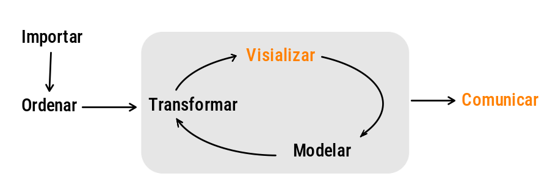
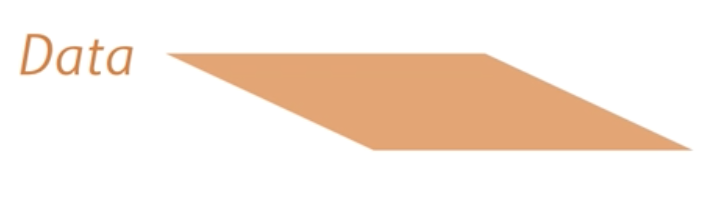

---
title: <span style="color:#235784"> </span>  
subtitle: <span style="color:#235784">**Unidad 1.1**</span> 
author: "dgonzalez "
output:
  html_document:
    toc: no
    toc_depth: 2
    toc_float: yes
    code_folding: hide
    theme: flatly
---    


<br/><br/>

```{r setup, include=FALSE}
knitr::opts_chunk$set(echo = TRUE, comment = NA)

# paleta de colores

# colores
c0= "#FFCC00"
c1= "#FFAD42"
c2= "#FF5A42"
c3= "#E1286F"
c4= "#4983F6"
c5= "#783AC7"
c6= "#2C5697" # AZZUL INSTITUCIONAL
c7= "#F7F7F7" # FONDO GRIS CLARO WEB

paleta4=c(c0,c1,c2,c3)


data2 <- data.frame(edad = c(13, 10, 14, 13, 14, 12, 11, 13, 13, 10, 13, 11, 13, 13, 12,  2,  9,  5,  3, 14,  4, 10, 13,  9,  7, 10,  9,  2, 13, 12,  4, 13, 13, 12,  2, 3, 10, 13, 13,  8, 13,  4,  9, 13,  9, 12, 11,  6,  8, 10,  5, 10, 13, 12,  5, 12,  3, 13, 12,  4, 12, 13,  6, 13,  8,  7, 10, 12, 13,  3,  8,  9,  8,  9, 11, 13, 10, 12,  4,  5, 13, 13, 14, 10,  13, 13, 10, 10, 13, 13, 12, 12, 14, 14, 14, 10, 12, 13, 14, 14, 12, 12, 10, 12, 12, 12, 12, 12, 13, 13, 13, 13, 12, 12,  2,  2,  9,  9,  5,  5,  4,  3, 14, 14,  4,  4, 10, 10, 14, 14,  9,  9,  7,  7,  9,  9,  9,  9,  2,  2, 13, 13, 13, 13,  3,  3, 13, 13, 13, 13, 12, 12,  2,  2, 4, 5, 10, 10, 13, 13, 13, 13,  9,  9, 14, 14,  4,  4, 9,  9, 14, 14, 10, 10, 13, 13, 12, 12,  7,  7,  9,  9, 10, 10,  6,  6, 11, 11, 14, 14, 13, 13,  5,  5, 13, 13, 3,  4, 13, 13, 13, 13,  4,  4, 13, 13, 13, 14,  7,  7, 14, 14, 15, 10,  8,  8, 11, 11, 12, 12, 14, 13,  4,  4, 9,  9,  9,  9,  9,  9,  9,  9, 12, 12, 11, 11),
sexo=  sample(c("Hombre","Mujer"), 236, replace = TRUE, prob = c(0.4,0.6)),
tipo = sample(c("1º","2º","3º","4º"), 236, replace = TRUE, prob = c(0.5,0.30,0.15,0.05))
)

```


# **Gráficos básicos**


<br/><br/>

La **visualización de datos** es una de las partes más importantes del análisis de datos, que permite de manera gráfica representar la información con el fin de poder resumirlos e interpretarlos.

Ya sea que estemos parados desde el lado de los lectores de informes o de los diferentes medios de cumunicación, los gráficos nos permiten entender mejor la realidad que los rodea.


<br/><br/>

```{r, echo=FALSE,  fig.align = "center",out.width="60%" }

```


Los gráficos constituyen una forma eficiente de mostrar los resultados obtenidos en una investigación, pero tambien nos permiten revisar la información contendida en una base de datos y darnos una primera imporesión sobre los resultados obtenidos. 


**Algunas consideraciones**


Empezaremos determinando el gráfico apropiado dependiendo del tipo de escala que tenga la variable a representar


<br/><br/>

|Tipo de variable | Tipos de escala  |  Tipo de gráfico            |  Sintaxis R          | 
|:----------------|:-----------------|:----------------------------|:---------------------|
| Cualitativa     | Nominal          |  diagrama de torta          |  pie(table(x))       |
|                 |                  |                             |                      |
|                 | Ordinal          |  diagrama de barras         |  barplot(table(x))   |
|                 |                  |  diag.barras dobles         |  barplot(table(x,y)) |
|                 |                  |  diag. mosaico              |  plot(x,y)           |
|                 |                  |                             |                      |
|Cuantitativa     | De intervalo     |  diagrama de tallos y hojas | stem(x)              |
|                 |                  |  histograma                 | hist(x)              | 
|                 | De razón         |  diagrama de puntos         | plot(x,y)            |
|                 |                  |  diagrama de densidad       | density(x)           |
|                 |                  |  diagrama de cajas          | boxplot(x)           |
|                 |                  |  diagrama de linea          | plot(x, type="l")    |
|                 |                  |                             |                      |
 
 **Nota**: Además de estas formas de representación gráfica existen otras formas que combinan variables como:
 
 + Mapas
 + Diagrama de mosaico
 + Diagramas de radar
 + diagramas likert
 + diagramas de piramide
 + diagramas animados
 
 
<br/><br/><br/>

# **Variable cualitativa-nominal**

Recordemos que una variable cualitativa (@) corresponde a una variables cuyos posibles valores que toma son palabras. En el caso de la escala nominal, indica que los valores solo se pueden comparar $=$ o $\neq$ . 

### **Ejemplo**

* **Tipo de homicidio **: femenicidio, homicidio culposo, homicidio doloso ....
* **Causa de muerte**: suicidio, accidente, ......
* **Tipo de arma utilizada**: arma de fuego, arma blanca, objeto contundente, ....
* **Condición legal del cadáver**: no identificado, desaparecido,....
* **Tipo de droga encontrada en el cuerpo**: cocaína, heroína, cannabis,... 

Para este tipo y escala de medición se recomiendan el diagrama circular, tambien llamados diagrama de torta, evitando los diagramas en 3D.

## **Diagrama circular**


<pre>
pie(x,                    # Vector numérico de valores para las porciones del pastel
labels = ,                # Vector de etiquetas para las porciones del pastel
edges = 200,              # Número de lados para aproximar un círculo
radius = 0.8,             # Radio del pastel
clockwise = FALSE,        # Indica si las porciones del pastel se dibujan en sentido horario o antihorario
init.angle = if(clockwise) 90 else 0,  # Ángulo inicial para la primera porción del pastel
density = NULL,           # Densidad de líneas para rellenar las porciones del pastel
angle = 45,               # Ángulo de inclinación para las etiquetas
col = NULL,               # Colores de las porciones del pastel
border = NULL,            # Color del borde de las porciones del pastel
lty = NULL,               # Tipo de línea del borde de las porciones del pastel
main = NULL,              # Título principal del gráfico
... )                     # Argumentos adicionales para la función pie
</pre>

```{r}
homicidios = c(3456, 10080,   8064)
names(homicidios) = c("Feminicidio","Homicidio culposo","Homicidio doloso")

# Ejemplo de datos
x <- c(10, 20, 30, 40)
nombres <- c("A", "B", "C", "D")

pie(homicidios)

```


Fuente : crimen_mx.csv

<br/><br/>


```{r}

labs <- names(homicidios)
pct=round(homicidios/sum(homicidios)*100) 
labs=paste(labs, pct);labs=paste(labs, "%", sep = " ") 
t1 = homicidios
pie(t1, 
    labels=labs, 
    main=" Tipo de homicidio",
    col=c("#023047", "#f4d35e", "#ee964b"))
```

<br/><br/><br/>

# **Variable cualitativa-ordinal**

<br/>

Para las variables cualitativas de escala ordinal (sus valores son palabras, pero se pueden ordenar)

### Ejemplo

* Grado de lesión: leve, moderado o grave.
* Grado de intoxicación:leve, moderado o grave.
* Grado de quemadura: primer grado, segundo grado o tercer grado.
* Estado mental: consciente, confuso o inconsciente.
* Grado de violencia: leve, moderado o grave.


## **Gráfico de barras**

<pre>
# Crear un gráfico de barras
barplot(x,                    # tabla de datos
  names.arg = nombres,       # Etiquetas para los datos
  beside = TRUE,             # Si es TRUE, las barras se apilan una al lado de la otra
  horiz = FALSE,             # Si es TRUE, las barras se dibujan horizontalmente
  density = NULL,            # Densidad de las líneas de relleno de las barras
  angle = 45,                # Ángulo de inclinación de las etiquetas
  col = NULL,                # Colores de las barras
  border = NULL,             # Color del borde de las barras
  main = NULL,               # Título principal del gráfico
  xlab = NULL,               # Etiqueta del eje x
  ylab = NULL,               # Etiqueta del eje y
  xlim = NULL,               # Límites del eje x
  ylim = NULL,               # Límites del eje y
  axes = TRUE,               # Si es TRUE, se dibujan los ejes
  axisnames = TRUE,          # Si es TRUE, se dibujan los nombres de los ejes
  cex.axis = 1,              # Tamaño de la fuente de los nombres de los ejes
  las = 1,                   # Orientación de los nombres de los ejes (1 = horizontal, 2 = perpendicular, 3 = vertical)
  ...)
</pre>


```{r}
# Generar datos aleatorios para un mayor número de pacientes
set.seed(123)  # Establecer una semilla para la reproducibilidad
num_pacientes <- 65
quemadura <-c("1º", "2º", "1º", "3º", "3º", "1º", "1º", "3º", "2º", "1º", "4º", "1º", "2º",
              "2º", "1º", "3º", "1º", "1º", "1º", "4º", "3º", "2º", "2º", "4º", "2º", "2º",
              "1º", "2º", "1º", "1º", "4º", "3º", "2º", "2º", "1º", "1º", "2º", "1º", "1º", 
              "1º", "1º", "1º", "1º", "1º", "1º", "1º", "1º", "1º", "1º", "3º", "1º", "1º",
              "2º", "1º", "2º", "1º", "1º", "2º", "3º", "1º", "2º", "1º", "1º", "1º", "2º")
datos <- data.frame(Paciente = 1:65, Grado = quemadura)

tabla2 <- table(quemadura)
# Ejemplo de datos
altura <- c(10, 20, 30, 40)
nombres <- c("A", "B", "C", "D")
```


```{r}

tabla4 <- c(36,17,8,4)
names(tabla4) <- c("1º", "2º", "3º", "4º") 

barplot(tabla4,  col=c("#FAf0CA", "#F4D35E", "#EE964B", "#F95738"), 
        main = "Tipos de quemaduras 2023",
        las=1 )
```
Fuente : información simulada

```{r}
tabla4 <- c(36, 17, 8, 4)
names(tabla4) <- c("1º", "2º", "3º", "4º")

# Crear el gráfico de barras
barplot(tabla4, col = c("#FAf0CA", "#F4D35E", "#EE964B", "#F95738"),
        main = "Tipos de quemaduras 2023",
        ylim = c(0, 40) ,  # Ajustar el límite del eje y para que quepan los valores
        las = 1,
        ylab = "frecuencia", 
        xlab = " grado de la quemadura" )

# Agregar los valores en cada barra
text(x = 1:4, y = tabla4, label = tabla4, pos = 1, cex = 1, col = "black")

```


<br/><br/><br/>

## **Gráfico de barras**

Es posible que se desee representar dos variables cualitativas al tiempo, por ejemplo 

```{r, message=FALSE, warning=FALSE}
namedadR <- c("menos de 1", " 1 - 5", " 6 - 11", "12 - 17", "18 - 28")
edadR <- c(22, 455, 701, 804, 472)
names(edadR) <- namedadR
barplot(edadR, las = 1, ylim = c(0, 900),
        main = "Violencia sexual por rango de edad - 2021",
        xlab = "edad - años",
        ylab = "frecuencia")
grid()


```


```{r}
namedadR <- c("menos de 1", " 1 - 5", " 6 - 11", "12 - 17", "18 - 28")
edadR <- c(22, 455, 701, 804, 472)
names(edadR) <- namedadR

barplot(edadR, las = 1, ylim = c(0, 900),
        main = "Violencia sexual por rango de edad - 2021",
        xlab = "edad - años",
        ylab = "frecuencia",
        col = "#FF8C00" , density = 45)
grid()
```

Ahora quiero visualizar por lugar de residencia - urbano rural

## **Diagrama de barras bivariado**

```{r}


data1 <- data.frame(quemadura <-c("1º", "2º", "1º", "3º", "3º", "1º", "1º", "3º", "2º", "1º", "4º", "1º", "2º",
              "2º", "1º", "3º", "1º", "1º", "1º", "4º", "3º", "2º", "2º", "4º", "2º", "2º",
              "1º", "2º", "1º", "1º", "4º", "3º", "2º", "2º", "1º", "1º", "2º", "1º", "1º", 
              "1º", "1º", "1º", "1º", "1º", "1º", "1º", "1º", "1º", "1º", "3º", "1º", "1º",
              "2º", "1º", "2º", "1º", "1º", "2º", "3º", "1º", "2º", "1º", "1º", "1º", "2º"),
              sexo = rbinom(65,1,0.4) )
  
tabla5 <- table(data1$sexo, data1$quemadura)
barplot(tabla5)
```


```{r}
tabla6 <- table(data1$quemadura, data1$sexo)
barplot(tabla6)
```


```{r}
colnames(tabla6) = c("Mujer", "Hombre")
barplot(tabla6, 
        las = 1,
        beside = TRUE,
        legend.text = c("1º", "2º", "3º","4º"),
        xlab = "sexo",
        args.legend = list(x = "topright", title = "grado quemadura"))
```

```{r}
# Crear una paleta de colores degradada de rojos
red_palette <- colorRampPalette(c("#FFC685", "#AE123A"))(4)
barplot(tabla6, 
        las = 1,
        main = "Tipo por sexo",
        beside = TRUE,
        legend.text = c("1º", "2º", "3º","4º"),
        xlab = "sexo",
        args.legend = list(x = "topright", title = "grado quemadura"),
        col = red_palette)


```


## **4. Diagrama de mosaico **


```{r}
mosaicplot(~sexo + quemadura,
            data =data1,
            main = " Tipo quemadura por sexo", 
            col=red_palette,
            las = 1, 
            ylab = "Tipo",
            xlab= "Sexo",
            cex.axis = 1) 
```


<br/><br/><br/>

# **Variables cuantitativas**

## **Diagrama de tallos y hojas**


```{r}
# Diagrama de tallos y hojas
stem(data2$edad)
```

<br/><br/><br/>

## **6. Histograma**

```{r}
hist(data2$edad)
```


```{r}
h1=hist(data2$edad, 
        breaks = 5,
        main = "Edad", 
        xlab = "años", 
        ylab="frecuencias", 
        labels=TRUE, 
        col="#ABBCC9",
        ylim = c(0,100),
        las =1)
grid()

```
<br/><br/><br/>

## **7. Diagrama de densidad**

```{r}

plot(density(data2$edad, na.rm = TRUE))
```


```{r}
plot(density(data2$edad, na.rm = TRUE),
     main="Distribución edad", 
     col="#0d3b66", 
     lwd=2,
     las=1, 
     xlab = "Nota",
     ylab = "Densidad")
```

<br/><br/><br/>

## **8. Diagrama de cajas** 

<pre>
# Ejemplo de datos
altura <- c(10, 20, 30, 40)
grupo <- c("A", "B", "A", "B")

# Crear un gráfico de diagrama de caja
boxplot(x,                    # Datos numéricos a visualizar
  data = NULL,                # Un data frame (opcional) del cual extraer los datos
  horizontal = FALSE,         # Si es TRUE, los diagramas de caja se dibujan horizontalmente
  add = FALSE,                # Si es TRUE, añade el diagrama al gráfico actual
  at = NULL,                  # Posiciones en las que dibujar los diagramas de caja
  coef = 1.5,                 # Coeficiente para determinar los valores atípicos
  boxwex = 0.8,               # Ancho relativo de las cajas
  staplewex = 0.5,            # Ancho relativo de las líneas que conectan las cajas y los bigotes
  range = 1.5,                # Factor multiplicativo para calcular el rango de los bigotes
  outline = TRUE,             # Si es TRUE, se dibujan los puntos atípicos fuera de los bigotes
  border = par("fg"),         # Color del borde de las cajas
  col = NULL,                 # Colores de las cajas
  log = "",                   # Especifica si se deben hacer transformaciones logarítmicas
  ylab = "Valores",           # Etiqueta del eje y
  xlab = "Grupos",            # Etiqueta del eje x
  notch = FALSE,              # Si es TRUE, se dibujan muescas en las cajas
  outlinecolors = par("fg"), # Color de los puntos atípicos
  
  # Parámetros relacionados con la leyenda
  names = NULL,                # Nombres de los diagramas de caja
  main = NULL,                 # Título principal del gráfico
  sub = NULL,                  # Subtítulo del gráfico
  cex = 1,                     # Tamaño de las etiquetas
  font = NULL,                 # Fuente de las etiquetas
  col.main = NULL,             # Color del título principal
  col.sub = NULL,              # Color del subtítulo
  col.lab = NULL,              # Color de las etiquetas de los ejes
  cex.main = 1,                # Tamaño del título principal
  cex.sub = 1,                 # Tamaño del subtítulo
  cex.axis = 1,                # Tamaño de las etiquetas de los ejes
  mgp = NULL,                  # Posición de las etiquetas de los ejes
  font.axis = NULL,            # Fuente de las etiquetas de los ejes
  col.axis = NULL,             # Color de las etiquetas de los ejes
  ...)
</pre>

```{r}
boxplot(data2$edad)
```


```{r}
boxplot(data2$edad, main="Edad",
        col="#f4d35e",
        las=1)
abline(h=6, col="#f95738", lwd=3)
```


```{r}
boxplot(data2$edad, main="Edad",
        col="#f4d35e",
        las=1,
        horizontal = TRUE)
abline(v=6, col="#f95738", lwd=3)
```


<br/><br/><br/>

## **9. Comparación diagrama de cajas**


```{r}

boxplot(data2$edad ~ data2$sexo,
         main="Edad por sexo",  
         col=c("#34b5aa","#ecbe14"),
         xlab = "Grupo", ylab = "años")

abline(h=4, col="#447270", lwd=2)
```

<br/><br/><br/>

## **10. Gráfico de series de tiempo**

```{r}
t=1:300 ; x=w=rnorm(300,0,1); x<-w; for(t in 2:300) x[t]<-x[t-1]+w[t]

plot(x, type="l",
     main="Número de pasajeros", 
     col="#ee964b", 
     lwd = 2)
```


<br/><br/><br/>

## **11. Resumen**

```{r, eval=FALSE }
x=rnorm(100,100,20)
y=rnorm(100,100,25)
z=rbinom(100,4,0.30)
t=1:100
pie(table(z))
barplot(table(z))
stem(x)
hist(x)
boxplot(x)
plot(x,y)
plot(t,y, type="l")
plot(density(x))
```

<br/><br/>

# **Paquetes adicionales**

Hasta el momento se ha utilizado R base para la elaboración de gráficos, a continuación se presentan algunos paquetes que mejoran la construcción de gráficos y su visualización :

<br/><br/>

## **ggplot2**. 


Este paquete de R permite la construcción de gráficos utilizando para ello una "grámatica" de los grafocos, la cual incorpora componentes como : los datos (data), un conjunto de coordenadas ( ), una serie de geometrias (geoms)  

Componentes de un gráfico en ggplot2:

+ **Data**: capa de los datos

+ **Aesthetics**: capa estetica (aes), definimos las variables a utilizar en el gráfico

+ **Geometries**: capa de geometrias, se define el tipo de gráfica a realizar

+ **Facets**: capa de facetas, permite detallar la gráfica por categorias

+ **Statistics**: capa de estadística, permite agregar modelos

+ ***Coordinates**: capa de coordenadas, permite ajustar las escalas de los ejes

+ **Theme**: capas de características del gráfico que no dependen de los datos

<br/><br/>

Para empezar, inicialmente se instalar el paquete

```{r, eval=FALSE}
install.packages("ggplo2")
```
Y luego habilitarlo para su uso

```{r}
library(ggplot2)
```

Se empieza con el primero de los lienzo, donde se declara la data que vamos a utilizar

{width=50%}

```{r}
library(ggplot2)
fig=ggplot(data=data2)
fig
```


Como segundo paso se definen las variables que se van a utilizar en la construcción del gráfico

{width=50%}

```{r}
library(ggplot2)
fig=ggplot(data=data2,  aes(x=edad , y=sexo))
fig
```

Luego de tener definida la base y las variables a utilizar se indica la geometria a utilizar, en este caso se trata de puntos

{width=50%}

```{r}
library(ggplot2)
fig=ggplot(data=data2,  aes(x=edad , y=sexo)) +
  geom_boxplot()
fig
```

Otros elementos a utilizar son :

### **facet**  que nos ayuda a visualizar el gráfico por factor, construyendo la gráfica para cada mes en este caso


{width=50%}

```{r}
library(ggplot2)
fig=ggplot(data=data2,  aes(x=edad , y=sexo)) +
  geom_boxplot() + 
  facet_wrap(~ tipo) 
fig
```

### **stat** permite realizar modelos lineales y mostrar asi la relación existente entre las variables 

{width=50%}

```{r}
library(ggplot2)
fig=ggplot(data=data2,  aes(x=edad , y=sexo)) +
  geom_boxplot() + 
  facet_wrap(~ tipo) +
  coord_flip()
fig

```

### **coordinates**  la cual permite ajustar los ejes , por ejemplo podemos determian el rango de que queremos presentar en la gráfica

{width=50%}

```{r}
library(ggplot2)
fig=ggplot(data=data2,  aes(x=edad , y=sexo)) +
  geom_boxplot() + 
  facet_wrap(~ tipo) +
  coord_flip() +
  scale_y_discrete(name = "Sexo") +
  scale_x_continuous(name = "Edad", breaks = seq(0, 20, by = 2))
fig

```

### **themes**  finalmente la capa del tema o fondo de la gráfica


{width=50%}

```{r}
library(ggplot2)
fig=ggplot(data=data2,  aes(x=edad , y=sexo, fill = tipo)) +
  geom_boxplot() + 
  scale_fill_manual(values = red_palette)+
  facet_wrap(~ tipo) +
  coord_flip() +
  scale_y_discrete(name = "Sexo") +
  scale_x_continuous(name = "Edad", breaks = seq(0, 20, by = 5)) +
  theme()
fig
```

## **highcharter**  


<br/><br/>

```{r }
 require(sp)
 require(rgdal)
 require(raster)
 require(RColorBrewer)
library(tidyverse)

 mi.palette <- brewer.pal(n = 7, name = "OrRd")   # paleta de colores
 mapco=shapefile("/home/deg/Documentos/JAVERIANA/EDUCON/repository/cursoML/presenta1/map/colombia/depto.shp")  # importa mapa en formato .shp
 # colombia=readRDS("data/Colombia.RDS")
 # colombia$departamento_nom= str_to_upper(colombia$departamento_nom)
 # t=table(colombia$departamento_nom,colombia$estado)
 fallecidos=c(15174,3876,26516,807,2417,2151,880,1333,2388,3487,6495,382,2880,
             1296,1380,2076,2861,3961,1635,2119,6934,1546,3411,11929,400,844,
             620,249,29,87,17,45,133) # vector con información
 mapco@data$fallecidos=fallecidos # se adiciona variable con 33 valores = 33 dptos, en mismo orden
 spplot(mapco[,6], col.regions = mi.palette, cuts = 6)  # mapa
```


## **tmap**

https://www.jstatsoft.org/article/view/v084i06


<br/><br/><br/> 

#  **Margenes de los gráficos**

```{r}
# Grafico normal
x=rnorm(100,100,20)
plot(density(x))
```

### **margenes de la grafica  c(bottom, left, top, right)**

```{r}

par(mar = c(5, 4, 4, 2) + 0.1)
x=rnorm(100,100,20)
plot(density(x))
```

###  **margenes de la gráfica**

```{r}

par(mai = c(1.5, 1.5, 1.5, 1.5))
x=rnorm(100,100,20)
plot(density(x))

```
 
 ### **Matriz de gráficos mfrow = c(2, 2)**

```{r}
x=rnorm(100,100,20)
y=rnorm(100,100,25)
z=rbinom(100,4,0.30)
t=1:100
par(mfrow = c(2, 2) ) # definición de la matriz

plot(density(x))
barplot(table(z))
hist(x)
plot(x,y)
```


### **margenes exteriores c(bottom, left, top, right)**

```{r}

par(mfrow = c(2, 2),   # matriz de graficos 2x2
    oma = c(3, 5, 2, 4) )  # margenes de la imagen
plot(density(x))
barplot(table(z))
hist(x)
plot(x,y)

```

# **Tamaño texto**


```{r}
x=rnorm(100,100,20)
plot(density(x),cex.lab=.8,  # tamaño de etiqueta ejes
                cex.axis=2, # tamaño escalas de los ejes 
                cex.main=1.5, # tamaño del titulo
                cex.sub=1)    # tamaño del subtitulo
```


https://r-charts.com/es/r-base/margenes/
